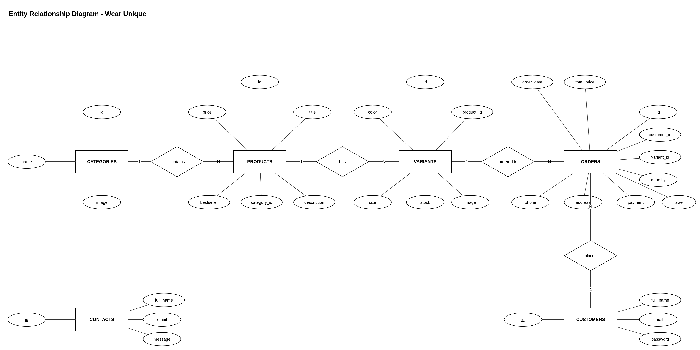
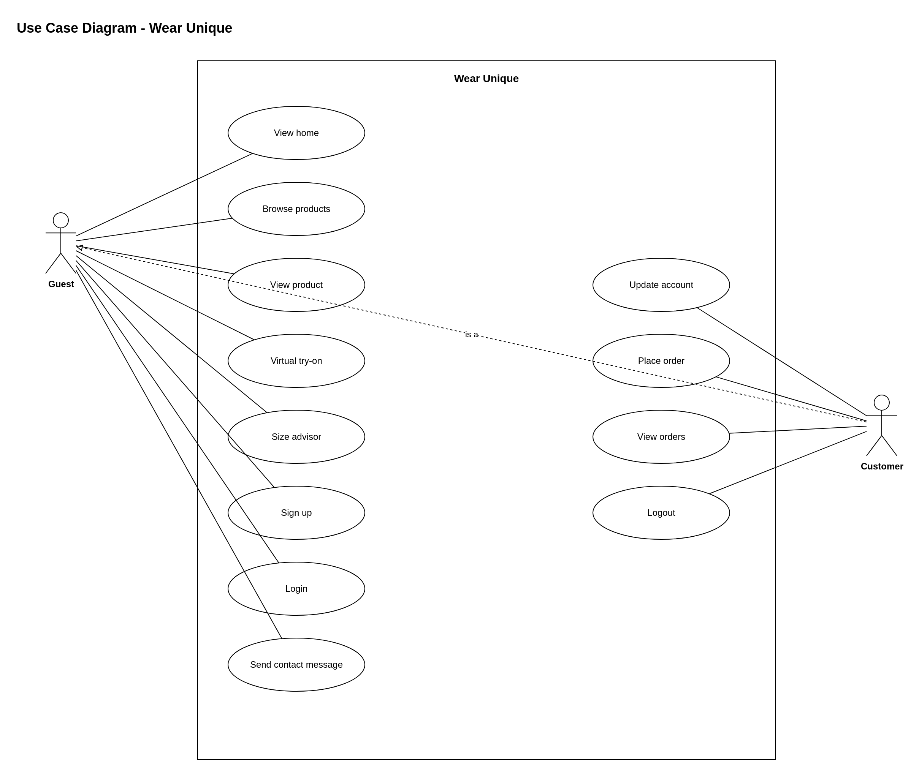

# Wear Unique

Wear Unique is an online clothing shop for men and women.

A customer can browse products, see colors and sizes, get a size suggestion, try a cloth on their photo, create an account, and place an order with Cash on Delivery.

## Features

- Home page with best selling products and categories
- Women and Men shop pages
- Product page with color and size options
- Virtual try-on
- AI size advisor
- Sign up, login, and logout
- Account page
- Checkout with Cash on Delivery
- Order history
- Contact form

## Technology Stack

| Part | Technology |
| --- | --- |
| Language | Python |
| Backend | FastAPI |
| Frontend | HTML, CSS, Jinja2 |
| Database | MySQL / MariaDB (XAMPP) |
| Server | Uvicorn |
| Login session | Starlette SessionMiddleware |
| Size advisor | Google Gemini API |
| Virtual try-on | Separate service |

## System Design

The site works in this order:

1. The user opens the website in a browser.
2. FastAPI in `app.py` receives the request.
3. The app reads or writes data in the MySQL database.
4. Jinja2 fills an HTML page and sends it back to the browser.
5. Size advisor sends body measurements to Gemini and shows S, M, L, or XL.
6. Virtual try-on sends the user photo and the selected cloth to another service.

```
Browser
   |
   v
FastAPI app
   |         |            \
   |         |             \
   v         v              v
MySQL    Gemini API    Try-on service
database               
```

## Database Design

The database name is `wear_unique`. There are 6 tables.

| Table | What it stores |
| --- | --- |
| `categories` | Women and Men |
| `products` | Product name, price, description |
| `variants` | Color, size, image, and stock for each product |
| `customers` | Name, email, and password |
| `orders` | Customer order, phone, address, payment |
| `contacts` | Messages from the contact page |

### Relationships

- One category has many products
- One product has many variants
- One customer can have many orders
- One variant can be used in many orders
- `contacts` is a separate table

### ER Diagram

The ER diagram uses Chen notation.

- Rectangle = entity (table)
- Ellipse = attribute (column)
- Underlined attribute = primary key
- Diamond = relationship
- `1` and `N` = one-to-many



The editable draw.io file is `docs/er-diagram.drawio`.

## Use Case Diagram

The use case diagram shows who can use the system.

There are two actors:

- **Guest** — not logged in
- **Customer** — logged in

The dashed **is a** line means a Customer can also do Guest actions.

**Guest**

- View home
- Browse products
- View product
- Virtual try-on
- Size advisor
- Sign up
- Login
- Send contact message

**Customer**

- All Guest actions
- Update account
- Place order
- View orders
- Logout



The editable draw.io file is `docs/use-case-diagram.drawio`.

## User Interface

Every page has the logo, menu (Home, Women, Men, Contact), and an account icon.

| Page | What the user sees |
| --- | --- |
| Home | Banner, best sellers, Women and Men cards |
| Shop | Product cards for one category |
| Product | Colors, sizes, Buy Now, Try Now, size advisor |
| Checkout | Phone, address, quantity, Cash on Delivery |
| Login / Signup | Email and password forms |
| Account | Update name, Orders, Logout |
| Orders | Past orders with image, color, size, and total |
| Contact | Name, email, and message form |

## How to Run 

To run this project we need to follow this steps.

### Need to follow this 

1. **Git**  
   [https://git-scm.com/downloads](https://git-scm.com/downloads)

2. **Python 3**  
   [https://www.python.org/downloads](https://www.python.org/downloads)  
   During install, tick **Add Python to PATH**.

3. **XAMPP**  
   [https://www.apachefriends.org](https://www.apachefriends.org)  
   Used for MySQL.

Check Python:

```
python --version
```

---

### Step 1: Clone the project

Open PowerShell or Command Prompt and run:

```
git clone https://github.com/zoyazubairi/wear_unique.git
cd wear_unique
```

---

### Step 2: Start MySQL

1. Open **XAMPP Control Panel**.
2. Click **Start** next to **MySQL**.
3. Also start **Apache** (needed for phpMyAdmin).

Leave XAMPP open.

---

### Step 3: Import the database

Do this the first time only.

1. Open [http://localhost/phpmyadmin](http://localhost/phpmyadmin)
2. Click **New**
3. Database name: `wear_unique`
4. Click **Create**
5. Click the `wear_unique` database
6. Click **Import**
7. Choose this file from the cloned folder:

```
database/wear_unique.sql
```

8. Click **Go**

This creates the tables and adds the sample products.

---

### Step 4: Create the `.env` file

In the cloned project folder, copy the example file:

```
copy .env.example .env
```

Open `.env` and put your values:

```
SECRET_KEY=wearunique123
GEMINI_API_KEY=your_gemini_api_key_here
```

- `SECRET_KEY` can be any text
- `GEMINI_API_KEY` is needed for size advisor  
  Get it from [Google AI Studio](https://aistudio.google.com/apikey)
- Do not upload `.env` to GitHub

---

### Step 5: Install packages

Stay inside the cloned folder and run:

```
pip install -r requirements.txt
```

---

### Step 6: Start the website

```
python -m uvicorn app:app --reload --port 8007
```

When it works, you will see:

```
Uvicorn running on http://127.0.0.1:8007
```

---

### Step 7: Open the site

In the browser open:

```
http://127.0.0.1:8007
```

To stop the server, go back to the terminal and press `Ctrl + C`.

---

### Virtual try-on 

The shop works without this.

**Try Now** needs another project running on port **8005**. If that service is off, the rest of the site still works.

---

### If something goes wrong

**`python` is not recognized**  
Reinstall Python and tick **Add Python to PATH**.

**Database error**  
MySQL is not started, or `database/wear_unique.sql` was not imported.

**Port 8007 already in use**

```
python -m uvicorn app:app --reload --port 8008
```

Then open `http://127.0.0.1:8008

**Size advisor does not work**  
Check `GEMINI_API_KEY` in `.env`.

## Project Folder

```
wear_unique/
├── app.py
├── size_advisor.py
├── requirements.txt
├── .env.example
├── .env                
├── database/
│   └── wear_unique.sql
├── templates/
├── static/
└── docs/
    ├── er-diagram.png
    ├── er-diagram.drawio
    ├── use-case-diagram.png
    └── use-case-diagram.drawio
```

## Notes

- Payment is Cash on Delivery only.
- Size advisor needs a Gemini API key.
- Passwords are stored as plain text. A live shop should hash passwords.
